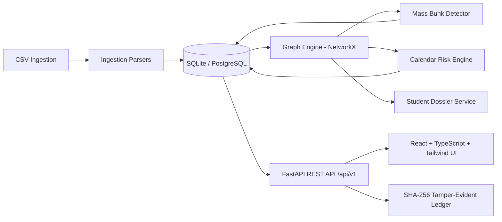

.
# Makerov (Student-catching, Bunkpredictor, Class-Analyser) — Classroom Intelligence Platform

> *"A teacher's sixth sense — support before sanction."*

Makerove is a production-grade classroom intelligence platform designed for higher education institutions. It ingests academic operational data (attendance registers, timetables, academic calendars, student rosters) into a **social knowledge graph** using NetworkX and SQLite to detect coordinated absences ("mass bunks"), identify structural anchors without punitive labeling, forecast holiday risk days, and recommend proactive, ethical interventions.

---

## 1. Data Sources & Authenticity (Zero Vibecoding Guarantee)

**Makerove contains ZERO hardcoded metrics, ZERO fake students, and ZERO simulated analysis in production paths.**

Every number, centrality metric, risk percentage, and chart shown to the user is mathematically computed from actual ingested records:
- **Total Students & Attendance:** Aggregated via SQL queries on `students` and `attendance` tables.
- **Social Graph & PageRank:** Computed via `networkx.pagerank()` and `networkx.betweenness_centrality()` on the bipartite co-absence projection graph.
- **Social Cohorts:** Clustered via `networkx.community.louvain_communities()`.
- **Mass Bunk Detection:** Calculated by scanning session attendance where absent proportion exceeds class threshold (&ge; 40%). Ringleaders are identified as the highest-PageRank node among absentees.
- **Calendar Risk Engine:** Mathematically predicted by evaluating session proximity to holidays in `calendar_days` and historical Friday absence rates.
- **Audit Logs:** Every read and write is sealed into an immutable SHA-256 cryptographic hash chain verifying tamper-evidence.

When the database is empty, Makerove renders **honest empty states** directing educators to upload registers, never fake data.

---

## 2. Architecture Overview



---

## 3. First-Time Setup Flow

Follow this sequence to ingest your classroom data and watch the intelligence dashboard populate:

1. **Ingest Student Roster:**
   - Format: `roll_no, name, section_code, branch, year, dob, gender`
   - UI: **Data Ingestion** &rarr; Select *Student Roster* &rarr; Upload CSV.
2. **Ingest Academic Calendar:**
   - Format: `date, name, type, is_holiday`
   - UI: **Data Ingestion** &rarr; Select *Academic Calendar* &rarr; Upload CSV.
3. **Ingest Weekly Timetable:**
   - Format: `section_code, day, period, subject_code, teacher_id`
   - UI: **Data Ingestion** &rarr; Select *Weekly Timetable* &rarr; Upload CSV.
4. **Ingest Attendance Register:**
   - Format: `date, roll_no, period, subject_code, status`
   - UI: **Data Ingestion** &rarr; Select *Attendance Register* &rarr; Upload CSV.
5. **View Computed Intelligence:**
   - Navigate to **Overview (Dashboard)** to see live KPIs and weekly trends.
   - Navigate to **Social Knowledge Graph** to inspect students, PageRank scores, and co-absence connections.
   - Navigate to **Mass Bunk Alerts** to view detected coordinated sessions.
   - Navigate to **Academic Calendar** to view holiday risk forecasts.

---

## 4. Benchmark Sample Data Loader (Dev-Only)

For rapid evaluation and local demonstration, realistic benchmark datasets are stored in `sample_data/`:
- `sample_data/students_cs3b.csv` (12 enrolled students for Section CS-3B)
- `sample_data/academic_calendar_2024.csv` (Official university holidays & exams)
- `sample_data/timetable_cs3b.csv` (Weekly timetable slots)
- `sample_data/attendance_cs3b_oct.csv` (Attendance records with coordinated Friday bunks)

### Loading via UI (Dev Mode):
1. Navigate to **Data Ingestion**.
2. Click the banner button: **Load Sample Data (Dev Only)**.

### Loading via Curl / API (Requires `ENV=development`):
```bash
curl -X POST "http://localhost:8000/api/v1/admin/load-sample-data"
```
*Note: This endpoint is strictly blocked (`HTTP 403 Forbidden`) if `ENV` is set to `production`.*

---

## 5. Development Setup

### 1. Backend Setup
```bash
cd backend
python -m venv .venv

# Windows:
.venv\Scripts\activate
# Linux/macOS:
source .venv/bin/activate

pip install -e .
python ../scripts/seed_demo.py
uvicorn app.main:app --reload --port 8000
```

### 2. Frontend Setup
```bash
cd frontend
npm install --legacy-peer-deps
npm run dev
```
Open [http://localhost:5173](http://localhost:5173) in your browser.

### 3. Run Automated Tests
```bash
cd backend
python -m pytest tests/test_dev_features.py -v
```

---

## 6. One-Click Launcher (Windows)
Double-click `start_application.bat` in the project root to launch both backend and frontend dev servers concurrently.
